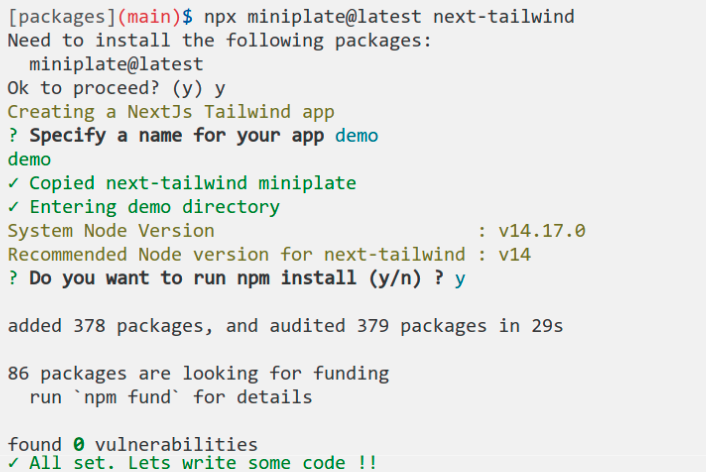

# miniplate

### Why
NextJS + TailwindCSS is my go to stack for prototyping something quickly. The current "npx create-next-app" creates a next app with a little bit of boilerplate (which I have to clean up), and then I have to configure tailwind and make it work.

Now I just run, npx miniplate next-tailwind

### Usage
```bash
npx miniplate next-tailwind 
```

### Miniplates
* next-tailwind - NextJS and Tailwind

### Demo

### Developer
Made by [anoop](https://twitter.com/anoopcodes)

### Contribute
Pull Requests always welcome, see [development guide](contributing.md)

### License
[MIT](LICENSE)
